<!--
Copyright (C) 2022-2024 Mitsubishi Electric Research Laboratories (MERL)

SPDX-License-Identifier: AGPL-3.0-or-later
-->

[](https://pubsonline.informs.org/journal/ijoc)

# Recursive McCormick Linearization of Multilinear Programs

This archive is distributed in association with the [INFORMS Journal on
Computing](https://pubsonline.informs.org/journal/ijoc) under the [AGPL-3.0 License](LICENSE.md).

This repository contains the problem instances and source code used in the article [Recursive McCormick Linearization of Multilinear Programs](https://doi.org/10.1287/ijoc.2023.0390), authored by David Bergman, Carlos Cardonha, Arvind U. Raghunathan, and Carlos J. Nohra.

**Important: This code is being developed on an on-going basis at https://github.com/merlresearch/OptimalRML.
Please go there if you would like to get a more recent version or would like support.**

## Cite

To cite the contents of this repository, please cite both the paper and this repo, using their respective DOIs.

https://doi.org/10.1287/ijoc.2023.0390

https://doi.org/10.1287/ijoc.2023.0390.cd

Below is the BibTex for citing this snapshot of the respoitory.

```BibTeX
@article{raghunathan2022recursive,
  title =     {Recursive McCormick Linearization of Multilinear Programs},
  author =    {Cardonha, Carlos and Raghunathan, Arvind U. and Bergman, David and Nohra, Carlos J.},
  publisher = {INFORMS Journal on Computing},
  year =      {2024},
  doi =       {10.1287/ijoc.2023.0390.cd},
  url =       {https://github.com/INFORMSJoC/2023.0390},
  note =      {Available for download at https://github.com/INFORMSJoC/2023.0390},
}
```

## Description

We compare algorithms for Minimum-size and Best-Bound McCormick linearizations with alternative techniques addressing similar problems. Moreover, we compare the performance of quadratized models with the state-of-the-art technique to solve multilinear optimization problems directly.

## Computational environment

The code is implemented in Python 3.10. We use Pyomo as modeling language (https://www.pyomo.org/). The code uses the following commercial software:
- Gurobi 11.0.2
- BARON 24.5.8
- CPLEX 22.1.1

We run our experiments in a Conda enviroment. The packages composing this environment are presented in the file `requirements.txt`. The code uses Gurobi, BARON, and CPLEX which are commercial software and require acceptance of appropriate license terms.

## **Test Sets**

The folder `data` contains the benchmark instances used in our experiments.

- The `vision` instances were created by *Crama Y, Rodrıguez-Heck E (2017) A class of valid inequalities for multilinear 0–1 optimization problems. Discrete Optimization 25:28–47.* We have translated these instances into a text format that can be parsed by our code.

- We generate all `mult_d_3` and `mult_d_4` instances using the procedure described in *Del Pia A, Khajavirad A, Sahinidis NV (2020) On the impact of running intersection inequalities for globally solving polynomial optimization problems. Mathematical programming computation 12(2):165–191.* The code used in the generation of these instances is presented in the folder `scripts\generate_mult_instances.

- The **autocorr** instances were extracted from http://polip.zib.de. We have translated these instances into a text format that can be parsed by our code.


## **Replicating**

The scripts used in the experiments are located in the folder `scripts` and can be replicated through the following steps:

1 - Create the database running the script `create_db.py`. This procedure will create the file `experiments.db` in the folder `/results`.

2 - Run the experiments by executing the script `run_all.py`. This procedure will populate the file `/results/experiments.db`.

3 - Generate the plots using the Python Notebook `Plots.ipynb`. This procedure will generate the plots used in the article.


## **Results**

The folder `results` contains the raw data of the experiments reported in the paper. We run our experiments on an Apple M1 Pro with 10 cores and 32 GB of RAM. We use GUROBI 11.0.2 to solve all the MIPs and QCPs. To solve the MLPs directly, we use BARON 24.5.8 with CPLEX 22.1.1 as the LP subsolver. We use default settings for all solvers. For the comparisons with `EV-MinLin` and `EV-BB`, we use the original Julia implementations of these algorithms, which were kindly provided by the authors.

The database containing the results of our experiments is located in the file `experiments.db`. This database also includes data from experiments with the original code used in  *Elloumi S, Verchere Z (2023) Efficient linear reformulations for binary polynomial optimization problems. Computers & Operations Research 155:106240*, which was kindly provided by the authors for our work. We have not included their codes in this repo, please contact them directly for their codes.


We reproduce below the plots presented in the article.


### Section 5.2 - Linearization size

The plots below present the reduction in the linearization size in comparison with the linearization strategy `Seq`.

Figure 6-a in the paper shows the results for 165 `mult3` instances.

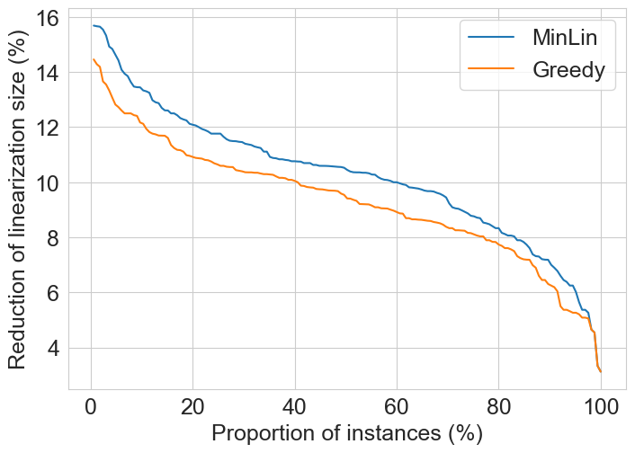

Figure 6-a in the paper shows the results for 165 `mult4` instances.

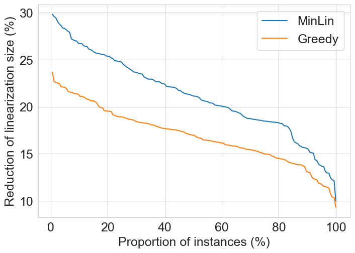


### Section 5.3 - LP bounds

The plots below present the root-node relaxation gaps for different linearization strategies in comparison with `Full`, which contains McCormick inequalities for all possible triples and delivering the strongest LP bound among all RMLs . We compare the LP relaxation of the linearization identified by the following algorithms:
- `Seq`: Standard sequential linearization;
- `Greedy`: Greedy linearization;
- `MinLin`: Minimum Linearization algorihtm;
- `BB`: Best-Bound Linearization algorithm


Figure 7-a in the paper shows the results for 165 `mult3` instances.

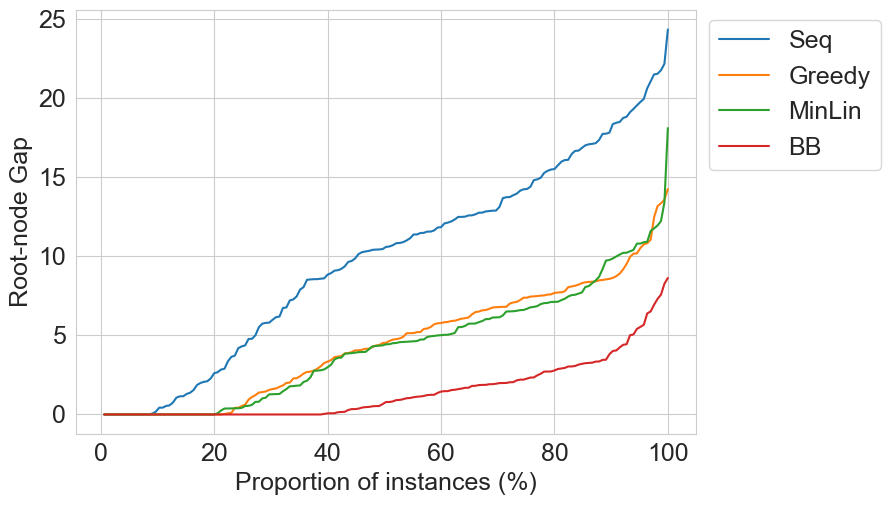

Figure 7-b in the paper shows the results for 165 `mult4` instances.

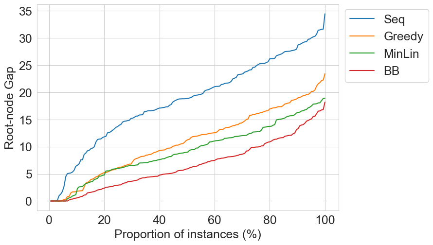

Figure 7-c in the paper shows the results for 45 `vision` instances.

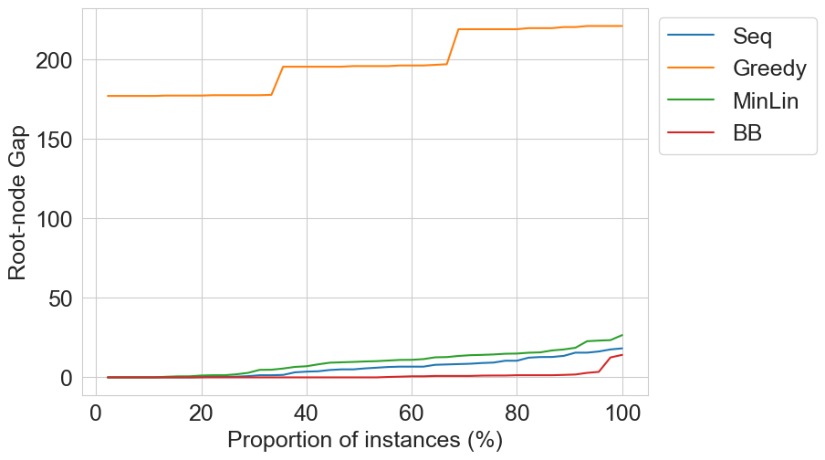

Figure 7-d in the paper shows the results for 33 `autocorr` instances.

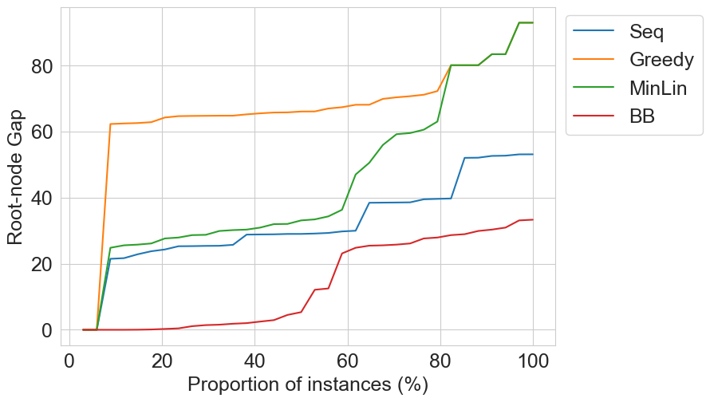


### Section 5.4 - Comparison of `MinLin` and `EV-MinLin`

This file contains the results of the Minimum-size linearization used in our work (`MinLin`) and the Best-Bound linearization code by Elloumi and Verchere (`EV-MinLin`). We eliminated 109 instances
which can be solved within 1 second by both algorithms.

Figure 8-a in the paper shows the results for 54 `mult4` instances.

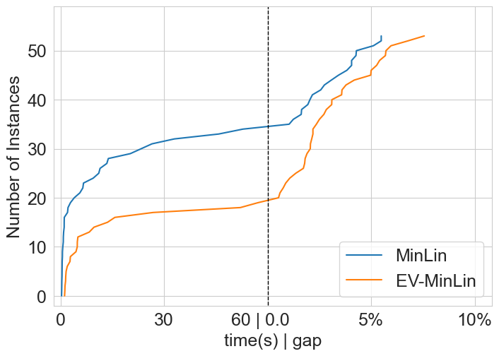

Figure 8-b in the paper shows the results for 33 `autocorr` instances.

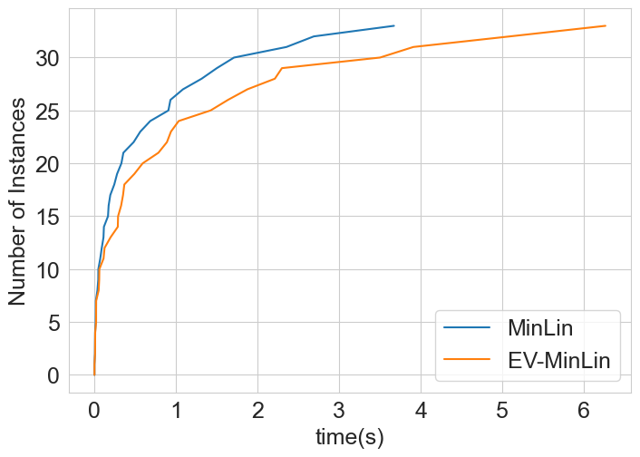


### Section 5.4 - Comparison of `BB` and `EV-BB`

This file contains the results of the Best-Bound linearization used in our work (`BB`) and the Best-Bound linearization code by Elloumi and Verchere (`EV-BB`). We exclude the results of 10 `mult4` instances for which `MinLin` and `EV-MinLin` obtain RMLs of different sizes. We also exclude 27 `mult4` instances for which the best-bound linearization MIPs built by `BB` and `EV-BB` are solved within one second.


Figure 9-a in the paper shows the results for 165 `mult3` instances.

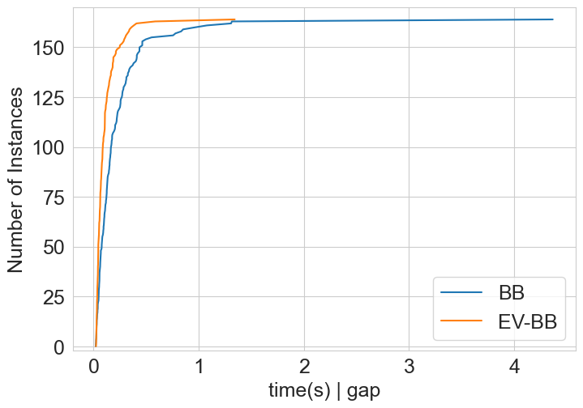

Figure 9-b in the paper shows the results for 127 `mult4` instances.

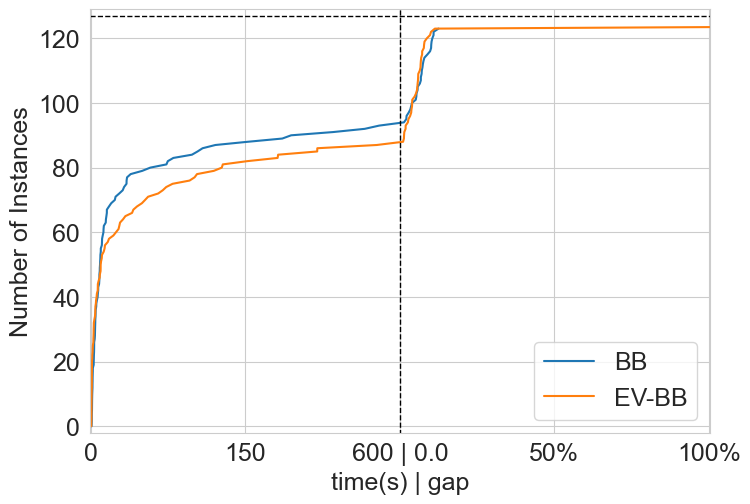

Figure 9-c in the paper shows the results for 45 `vision` instances.

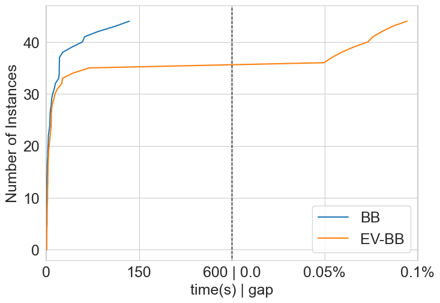

Figure 9-d in the paper shows the results for 32 `autocorr` instances.

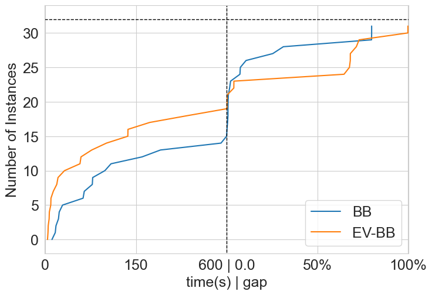


### Solution of the QCP and MLP formulations with global optimization solvers

We use the following algorithms to solve the original MLP:
- `GUROBI-QCP-Seq`: QCP reformulation of the MLP with linearization produced by `Seq`, solved with Gurobi;
- `GUROBI-QCP-Greedy`: QCP reformulation of the MLP with linearization produced by `Greedy`, solved with Gurobi;
- `GUROBI-QCP-MinLin`: QCP reformulation of the MLP with linearization produced by `MinLin`, solved with Gurobi;
- `GUROBI-QCP-BB`: QCP reformulation of the MLP with linearization produced by `BB`, solved with Gurobi;
- `BARON-MLP`: MLP solved directly with BARON (and CPLEX for LPs).


Figure 10-a in the paper shows the results for 42 `mult3` instances.

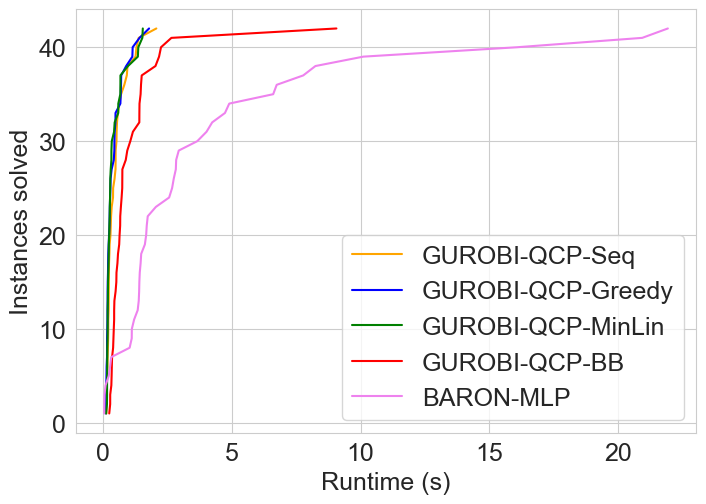

Figure 10-b in the paper shows the results for 143 `mult4` instances.

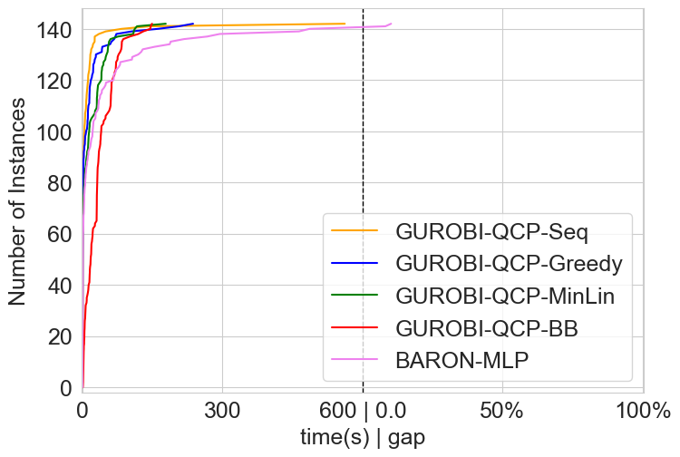

Figure 10-c in the paper shows the results for 41 `vision` instances.

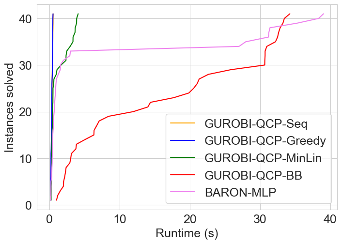

Figure 10-d in the paper shows the results for 32 `autocorr` instances.

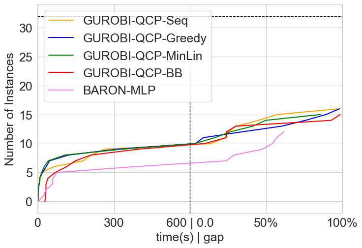


Comparison between `GUROBI-QCP-MinLin` and `BARON-MLP` 255 nontrivial instances.

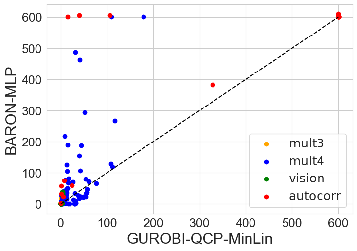


Comparison between `GUROBI-QCP-BB` and `BARON-MLP` 255 nontrivial instances.


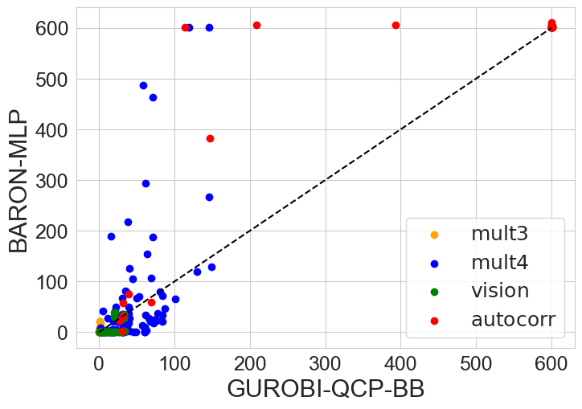

## Contact

If you have any question please contact us at:

* Arvind U. Raghunathan: raghunathan@merl.com
* Carlos Cardonha: carlos.cardonha@uconn.edu
* David Bergman: david.bergman@uconn.edu
* Carlos J. Nohra: carlos.nohra@gmail.com

## Contributing

See [CONTRIBUTING.md](CONTRIBUTING.md) for our policy on contributions.

## License

Released under `AGPL-3.0-or-later` license, as found in the [LICENSE.md](LICENSE.md) file.

All files:
```
Copyright (c) 2022-2024 Mitsubishi Electric Research Laboratories (MERL).

SPDX-License-Identifier: AGPL-3.0-or-later
```
